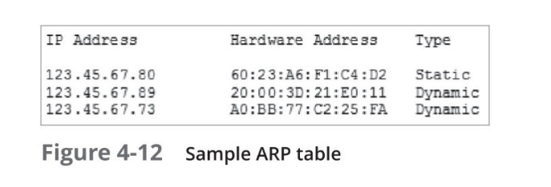

# ARP (Address Resolution Protocol)

- Works in conjunction with [[IP]]v4 to discover [[MAC address]] of host or node on local network
  - Also maintains database that maps [[IP address]]es to [[MAC address]]es on local network

## ARP Table

- Database containing IP --> MAC mappings
- Two types of entries
  - Dynamic
    - Created when client makes an ARP request that could not be satisfied with data existing in ARP table
  - Static
    - Those someone entered in manually with an ARP utility

[[Networking]] [[Computer Science]]

