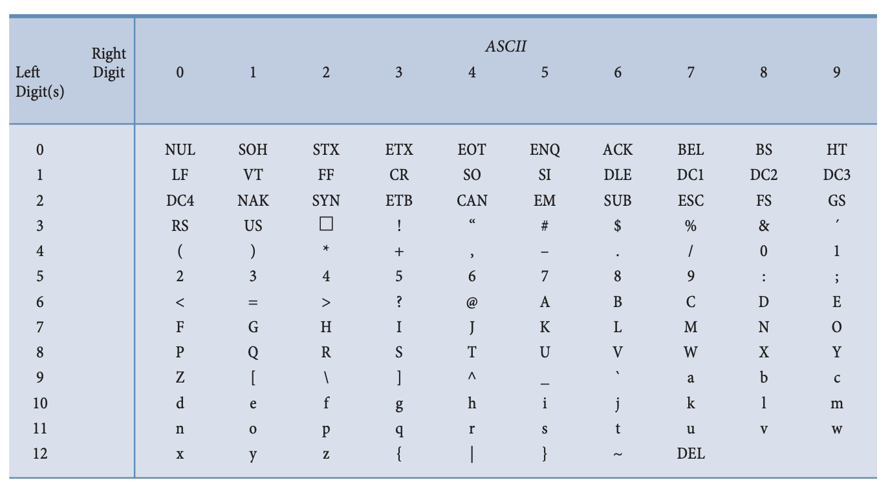

# ASCII

- American Standard Code for Informational Interchange
- Distinct order based on codes
  - Each character has relative position (before or after) other characters
  - Uppercase and lowercase letters are in order
  - Can use the codes to order things

## OG Set

- Used 7 bits to represent each character
- Allowed 128 unique characters
- 8th bit was a _check bit_

## Extended Set

- All 8 bits represented a character
- 8 bit version is called the _Latin-1 Extended ASCII [[character set]]_
- Allows 256 unique characters

[[Computer Science]] [[Character Set]]

[//begin]: # "Autogenerated link references for markdown compatibility"
[character-set]: character-set "Character Set"
[computer-science]: computer-science "Computer Science"
[//end]: # "Autogenerated link references"