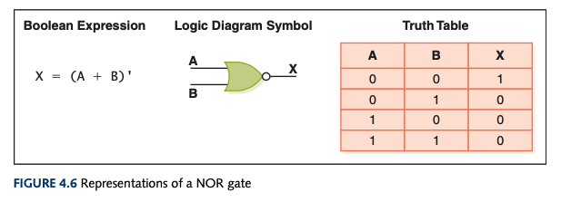

# Logic Gates

- Performs a basic operation on electrical signals
- Accepts one or more inputs and produces a single output signal
- Easiest gates to make are `NOT`, `NAND`, and `NOR` gates
  - 

## NOT

- Accepts an input
- Output is inverted of input
- An _inverter_
- [[Boolean algebra]]:
  - `A'`
  - The mark comes after a value being negated
  - Sometimes shown as horizontal bar over value being negated
- [[Logic diagram]]:
  - Small circle after a [[transistor]]

### NOT Truth Table

| A   | Output |
| --- | ------ |
| 0   | 1      |
| 1   | 0      |

## AND

- Accepts two inputs
- Outputs `1` if _both_ inputs are `1`
- Outputs `0` if _either_ input is `0`
- [[Boolean algebra]]:
  - `A • B` or `A * B` or `AB` or `A ^ B`

### AND Truth Table

| A   | B   | Output |
| --- | --- | ------ |
| 0   | 0   | 0      |
| 0   | 1   | 0      |
| 1   | 0   | 0      |
| 1   | 1   | 1      |

## OR

- Accepts two inputs
- Outputs `0` if _both_ inputs are `0`
- Outputs `1` otherwise
- [[Boolean algebra]]:
  - `A + B` or `A v B`

### OR Truth Table

| A   | B   | Output |
| --- | --- | ------ |
| 0   | 0   | 0      |
| 0   | 1   | 1      |
| 1   | 0   | 1      |
| 1   | 1   | 1      |

## XOR

- Exclusive `OR`
  - Only differs from an `OR` if both inputs are `1`
  - "When I say _or_, I mean one or the other, not both."
- Accepts two inputs
- Outputs `0` if the two inputs are the same
- Outputs `1` otherwise
- [[Boolean algebra]]:
  - Circle with a plus in it
  
### XOR Truth Table

| A   | B   | Output |
| --- | --- | ------ |
| 0   | 0   | 0      |
| 0   | 1   | 1      |
| 1   | 0   | 1      |
| 1   | 1   | 0      |

## NAND

- `NOT` + `AND`
  - It's an `AND` gate that gets inverted
- Accepts two inputs
- Outputs `0` if _both_ are `1`
- Outputs `1` otherwise
- [[Boolean algebra]]:
  - `(A • B)'`
  
### NAND Truth Table

| A   | B   | Output |
| --- | --- | ------ |
| 0   | 0   | 1      |
| 0   | 1   | 1      |
| 1   | 0   | 1      |
| 1   | 1   | 0      |

## NOR

- `NOT` + `OR`
  - It's an `OR` gate that gets inverted
- Accepts two inputs
- Outputs `1` if _both_ input is `0`
- Outputs `0` otherwise
- [[Boolean algebra]]:
  - `(A + B)'`
  
### NOR Truth Table

| A   | B   | Output |
| --- | --- | ------ |
| 0   | 0   | 1      |
| 0   | 1   | 0      |
| 1   | 0   | 0      |
| 1   | 1   | 0      |

[[Computer Science]]

