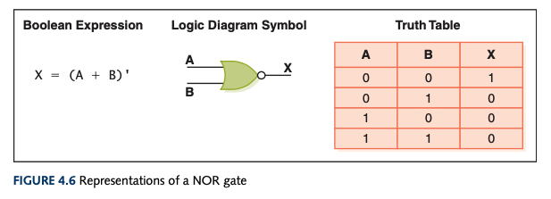

# Logic Gates

- Performs a basic operation on electrical signals
- Small circle represents the complement (`NOT`) operation
- Types:
  - `NOT`
  - `AND`
  - `OR`
  - `XOR`
  - `NAND`
  - `NOR`
- Easiest gates to make are `NOT`, `NAND`, and `NOR` gates
  - 

## `NOT`

- Accepts an input --> returns complementary
- Output is inverted of input

## `AND`

- Accepts two inputs
- Outputs `1` if _both_ inputs are `1`
- Outputs `0` if _either_ input is `0`

## `OR`

- Accepts two inputs
- Outputs `0` if _both_ inputs are `0`
- Outputs `1` otherwise

## `XOR`

- Exclusive `OR`
- Accepts two inputs
- Outputs `0` if the two inputs are the same
- Outputs `1` otherwise

## `NAND`

- `NOT` + `AND`
  - It's an `AND` gate that gets inverted
- Accepts two inputs
- Outputs `0` if _both_ are `1`
- Outputs `1` otherwise

## `NOR`

- `NOT` + `OR`
  - It's an `OR` gate that gets inverted
- Accepts two inputs
- Outputs `1` if _both_ input is `0`
- Outputs `0` otherwise

[[Computer Science]]

[//begin]: # "Autogenerated link references for markdown compatibility"
[Computer Science]: computer-science "Computer Science"
[//end]: # "Autogenerated link references"