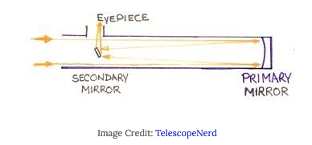

# Reflecting Telescope

- [[Mirror]]s instead of [[lens]]s
- Usually have two [[mirror]]s
  - Primary
  - Secondary
- Configurations
  - Newtonian
  - Cassegrain
    - Most amateur [[telescope]]s are Cassegrain
  - Nasmyth/Coudé
    - Commonly used as professional telescopes

## Advantages

- No chromatic aberration
  - All wavelengths of light reflect off the [[mirror]] the same
- Easily made to be big
- Cheaper than refractors of the same size
- Only one side of the objective needs to be perfect (reflecting vs. passing through)

## Disadvantages

- Easy to get optics out of alignment
- Optics need frequent cleaning
- Two [[mirror]]s --> can produce diffraction effects
  - "Christmas star" effect

[[Telescope]]

[//begin]: # "Autogenerated link references for markdown compatibility"
[Mirror]: mirror "Mirror"
[mirror]: mirror "Mirror"
[Telescope]: telescope "Telescope"
[//end]: # "Autogenerated link references"