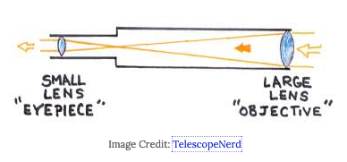

# Refracting Telescope

- First type of telescopes built
- [[Lens]]es instead of [[mirror]]s
- Use a glass objective [[lens]] to gather and focus [[light]]
  - [[Light]] passes through the lens and splits into [[wavelength]]s

## Advantages

- Rugged
- Rarely needs cleaning (glass is sealed inside)
- Tube is closed off from outside air so air/temperature has less impact

## Disadvantages

- [[Chromatic aberration]]
  - Colour deviation or distortion
  - When all the [[wavelength]]s are not capable of meeting at the same [[focal point]]

[[Telescope]]

[//begin]: # "Autogenerated link references for markdown compatibility"
[mirror]: mirror "Mirror"
[light]: light "Light"
[Light]: light "Light"
[wavelength]: wavelength "Wavelength"
[Chromatic aberration]: chromatic-aberration "Chromatic Aberration"
[wavelength]: wavelength "Wavelength"
[focal point]: focal-point "Focal Point"
[Telescope]: telescope "Telescope"
[//end]: # "Autogenerated link references"