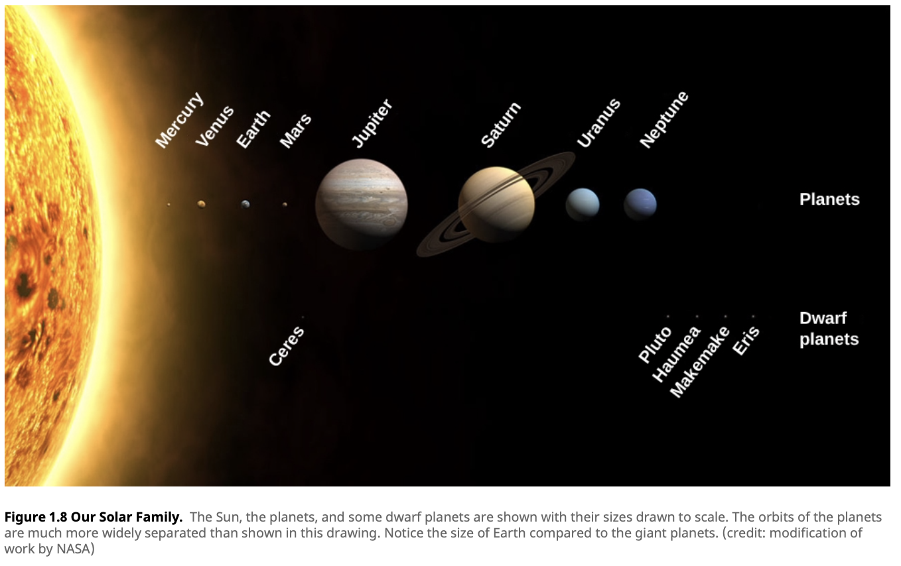

# The Solar System

- Our local [[solar system]]
- [[Planets]]
  1. [[Mercury]]
  2. [[Venus]]
  3. [[Earth]]
  4. [[Mars]]
  5. [[Jupiter]]
  6. [[Saturn]]
  7. [[Uranus]]
  8. [[Neptune]]

[[Space]] [[Astronomy]]

[//begin]: # "Autogenerated link references for markdown compatibility"
[solar system]: solar-system "Solar System"
[Mercury]: mercury "Mercury"
[Venus]: venus "Venus"
[Earth]: earth "Earth"
[Mars]: mars "Mars"
[Jupiter]: jupiter "Jupiter"
[Saturn]: saturn "Saturn"
[Uranus]: uranus "Uranus"
[Neptune]: neptune "Neptune"
[Space]: space "Space"
[Astronomy]: astronomy "Astronomy"
[//end]: # "Autogenerated link references"
