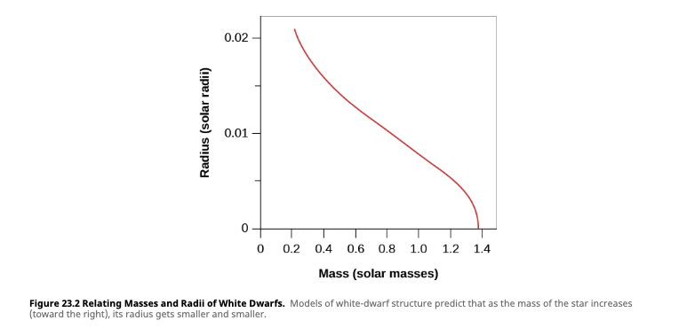

# White Dwarf

- [[Star]]s with a high [[temperature]] and low [[luminosity]]
  - Faint [[luminosity]] comes from stored energy
- Extremely dense
- Dying [[star]]s
  - [[Fusion]] no longer occurs
  - Its only [[energy]] is the heat created by the atomic nuclei in its interior
- Held up by electron degeneracy [[pressure]]
  - See [[degenerate gas]]
- The [[radius]] of the [[star]] shrinks as its [[mass]] increases
  - Puts a limit on the size of [[white dwarf]]s
  - A white dwarf with a mass ~1.4 $M_{Sun}$ would have a radius of zero
    - See: [[Chandrasekhar limit]]

[[Star]] [[Astronomy]]

